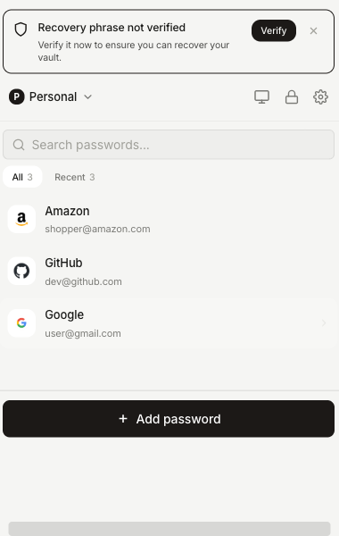
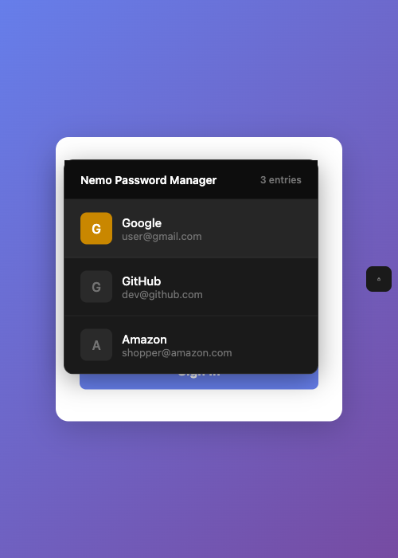
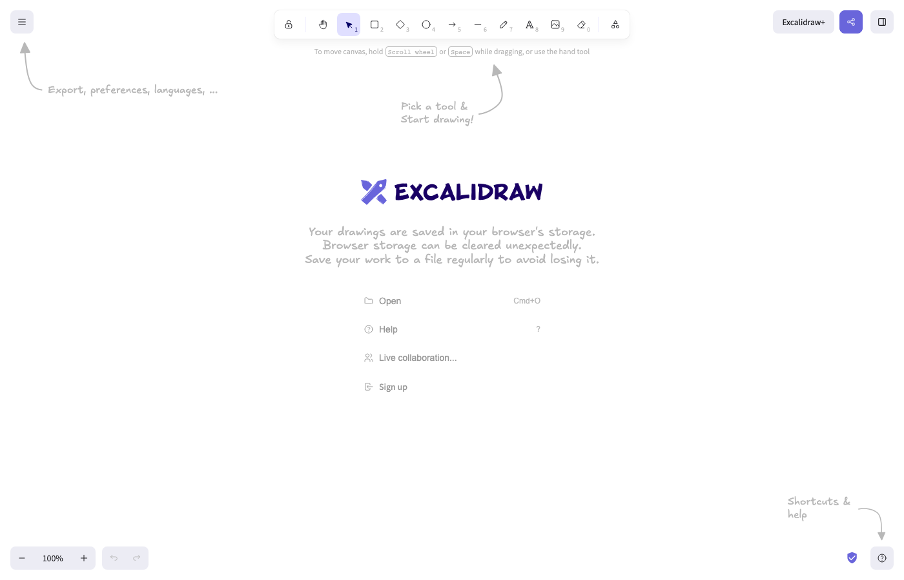

#  Nemo

[](LICENSE)


**Your passwords stay on your device. No accounts. No cloud. No tracking.**

Nemo is a browser extension that stores passwords encrypted with keys derived from your biometrics or PIN. The plaintext never leaves your device. Optional end-to-end encrypted sync lets you share vaults across devices without giving any server access to your data.

<p align="center">
  
</p>

<p align="center">
  
  
</p>

---

## Why Nemo

Most password managers store your vault on their servers. They hold the keys. They see everything.

Nemo works differently:

- **No accounts** – you do not create an account anywhere
- **No cloud dependency** – everything lives in your browser's private storage
- **No tracking** – no analytics, no telemetry, no phone home
- **Zero-knowledge by design** – even if you enable sync, the server sees only encrypted blobs

## What it does

- **Biometric unlock** – Touch ID, Face ID, Windows Hello via WebAuthn PRF
- **PIN fallback** – 4-6 digits with brute-force lockout
- **12-word recovery phrase** – BIP-39 standard, your backup if you lose your passkey
- **Auto-fill** – detects login forms and fills credentials
- **TOTP codes** – built-in 2FA authenticator (SHA-1, SHA-256, SHA-512)
- **Multiple vaults** – separate work, personal, shared credentials
- **Password generator** – configurable length, rejection sampling for uniform distribution
- **Encrypted export/import** – move backups between devices
- **Optional sync** – Cloudflare D1 or any custom backend, end-to-end encrypted

## Getting started

```bash
pnpm install
pnpm dev
```

Open `chrome://extensions`, enable Developer mode, click "Load unpacked", point it at `.output/chrome-mv3-dev`.

**Production build:**

```bash
pnpm build        # Chrome
pnpm build:firefox
```

**Run tests:**

```bash
pnpm test
cd tests && npm run test:e2e:all
```

**Generate fresh screenshots:**

```bash
cd tests && node screenshot-readme.mjs
```

---

## How encryption works

Nemo uses layered keys. No master password. Each unlock method (biometric, PIN, recovery phrase) derives its own wrapping key. That wrapping key encrypts a single vault key. The vault key does the actual data encryption.

### The vault key

Every vault gets a random 256-bit AES-GCM key at creation. It encrypts all entries, settings, and metadata. It exists only in memory while unlocked. Lock the vault and the key is dropped.

The vault key is never stored in plaintext. It is always wrapped by a key derived from one of your unlock methods.

### Unlock methods

**Biometric (WebAuthn PRF)**

Your device authenticator produces a deterministic PRF output tied to your credential. Nemo feeds this through HKDF-SHA256 with a 16-byte random salt and the info string `nemo-vault-key` to derive the wrapping key.

This is the primary method. The PRF output never leaves the authenticator hardware.

**PIN**

A 4-6 digit PIN is stretched through PBKDF2-SHA256 with 600,000 iterations and a 32-byte random salt. After 5 wrong attempts, PIN unlock locks out for 30 minutes.

**Recovery phrase**

12 words from the BIP-39 wordlist encode 128 bits of entropy with a 4-bit SHA-256 checksum. This is your fallback if you lose your passkey and your device.

### Key flow

```
You authenticate (biometric, PIN, or 12 words)
        |
        v
Key derivation (HKDF or PBKDF2)
        |
        v
Wrapping key (256-bit AES-GCM)
        |
        v
Unwrap the vault key (AES-GCM decrypt)
        |
        v
Vault key (256-bit, in memory)
        |
        v
Decrypt vault entries (AES-GCM)
```

### What the server sees

If you enable sync, the server receives ciphertext, salt, IV, KDF identifier, timestamps, and a device ID. It never sees the vault key, any wrapping key, your PIN, your recovery phrase, or your PRF output.

A compromised server leaks only encrypted blobs.

### Crypto parameters

| What | Algorithm | Key size | Salt/IV | Iterations |
|------|-----------|----------|---------|------------|
| Vault encryption | AES-256-GCM | 256-bit | 12-byte IV | – |
| Key wrapping | AES-256-GCM | 256-bit | 12-byte IV | – |
| PIN derivation | PBKDF2-SHA256 | 256-bit | 32-byte salt | 600,000 |
| Biometric derivation | HKDF-SHA256 | 256-bit | 16-byte salt | – |
| Recovery derivation | HKDF-SHA256 | 256-bit | fixed salt | – |
| Password generation | CSPRNG | – | 32-byte pool | rejection sampling |
| Recovery phrase | BIP-39 | 128-bit entropy | 4-bit checksum | 12 words |

All random values come from `crypto.getRandomValues()`. CryptoKey objects are created as non-extractable where possible.

### Architecture diagrams

**Encryption key hierarchy:**



**System components:**


---

## Architecture

### Storage

Nemo uses the Origin Private File System (OPFS) – a sandboxed filesystem only the extension can access. No localStorage, no cookies.

```
OPFS root/
  vault-registry.json              # list of vaults + active vault ID
  nemo-vault-{id}/
    vault.enc                      # encrypted vault (ciphertext + IV + salt)
    metadata.json                  # public metadata (salt, KDF type, timestamps)
```

Session state lives in `chrome.storage.session`, cleared on browser close. Theme preference and sync retry state use `chrome.storage.local`.

### Extension components

```
entrypoints/
  background.ts       Service worker. Routes messages, manages vault
                      lifecycle, auto-lock timer, keyboard shortcuts.

  content.ts          Content script. Detects login forms, shows
                      autofill overlay, handles credential capture.

  popup/App.tsx       Main popup UI. Entry list, search, add/edit,
                      settings, vault selector.

  webauthn/           Separate page for WebAuthn ceremonies.

vault/
  crypto.ts           AES-GCM encrypt/decrypt, PBKDF2 key derivation.
  storage.ts          OPFS read/write, Cloudflare D1 adapter.
  recovery.ts         BIP-39 phrase generation and recovery.
  pin.ts              PIN derivation, lockout tracking.
  custom-sync.ts      Custom backend adapter.
  sync.ts             Cloudflare D1 sync adapter.

utils/
  crypto.ts           Low-level crypto helpers.
  auth.ts             WebAuthn registration and authentication.
  totp.ts             TOTP implementation (RFC 6238).
  vault-ops/          Background-only vault operations.
```

### Auto-fill

The content script runs on every page:

1. Scans for username and password fields using type attributes, autocomplete hints, and name/id keywords
2. Attaches a small button next to detected fields
3. On click, queries the background for matching entries by URL
4. Shows an overlay with matching credentials
5. Fills the selected entry, dispatching `input` and `change` events for framework compatibility
6. On form submit (HTTPS only), offers to save new credentials

The overlay uses plain DOM (no `innerHTML`) to prevent XSS from page content.

### Sync

Sync is opt-in. By default, encrypted vault data syncs to a Cloudflare D1 database hosted at `nemo-sync.artyom-yagovdik.workers.dev`. You acknowledge that you are responsible for your own data and any risks. This project is not liable for data loss, breaches, or third-party costs.

Alternatively, run your own backend: any HTTP server implementing four endpoints: `POST /api/register`, `GET /api/vault`, `PUT /api/vault`, `HEAD /api/vault`. A reference server is in `backend/server.ts` (Express + SQLite).

Both use last-write-wins conflict resolution. The sync manager runs every 5 minutes while unlocked, with automatic retry (3 attempts, exponential backoff: 5s, 15s, 60s).

---

## Project structure

```
nemo/
  entrypoints/          Extension entry points
  vault/                Core vault logic
  utils/                Shared utilities
    vault-ops/          Background-only operations
  components/           React UI components
  backend/              Reference sync server
  config/               Extension configuration
  tests/                Unit and E2E tests
  style.css             Global styles
  wxt.config.ts         WXT extension framework config
```

## License

Apache 2.0. See [LICENSE](LICENSE).

## Privacy

See [PRIVACY.md](PRIVACY.md).

---

This is a personal project, not a commercial security product. Export your vault regularly. If you lose your recovery phrase and your passkey, your data is gone.
