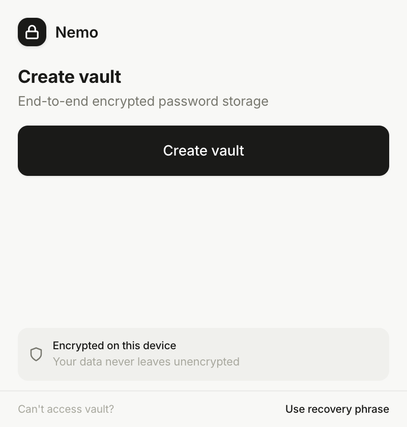
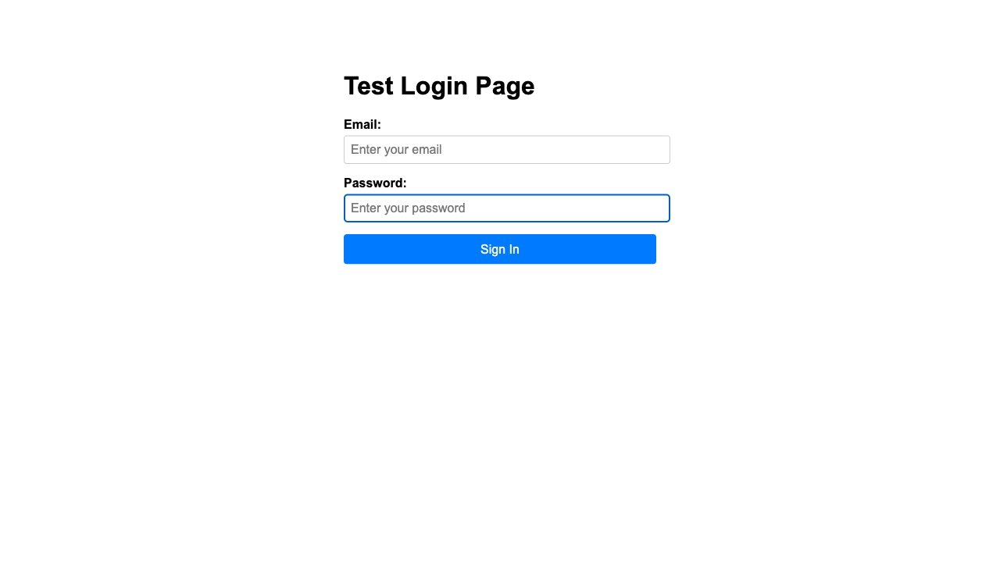

# Nemo

A zero-knowledge password manager that runs as a browser extension. No accounts, no cloud dependency, no tracking. Your passwords are encrypted with keys derived from your biometrics or a PIN -- the plaintext never leaves your device.

Nemo stores everything locally using the Origin Private File System. Optional end-to-end encrypted sync lets you share vaults across devices without giving the server access to your data.

## What it does

- **Biometric unlock** -- WebAuthn with PRF extension (Touch ID, Face ID, Windows Hello)
- **PIN unlock** -- 4-6 digit backup with brute-force lockout
- **12-word recovery phrase** -- BIP-39 standard, your last resort if you lose your passkey
- **Auto-fill** -- detects login forms and fills credentials with one click
- **TOTP codes** -- built-in 2FA authenticator (SHA-1, SHA-256, SHA-512)
- **Multiple vaults** -- separate work, personal, shared credentials
- **Password generator** -- configurable length and character sets, rejection sampling for uniform distribution
- **Export/import** -- encrypted backups you can move between devices
- **Sync** -- Cloudflare D1 or any custom backend, end-to-end encrypted
- **Themes** -- light, dark, follows system

## Getting started

```bash
pnpm install
pnpm dev
```

Open `chrome://extensions`, enable developer mode, click "Load unpacked", point it at `.output/chrome-mv3-dev`.

Production build:

```bash
pnpm build        # Chrome
pnpm build:firefox
```

Run tests:

```bash
pnpm test
cd tests && npm run test:e2e:all
```

---

## How encryption works

Nemo uses a layered key architecture. There is no master password. Instead, each unlock method (biometric, PIN, recovery phrase) derives its own wrapping key that encrypts and decrypts a single vault key. The vault key does the actual data encryption.

### The vault key

Every vault gets a random 256-bit AES-GCM key at creation time. This key encrypts all entries, settings, and metadata inside the vault. It only exists in memory while the vault is unlocked. When you lock the vault, the key is dropped.

The vault key is never stored in plaintext. It is always wrapped (encrypted) by a wrapping key derived from one of your unlock methods.

### Unlock methods

Each method derives a 256-bit AES-GCM wrapping key through a different path:

**Biometric (WebAuthn PRF)**

Your device authenticator produces a deterministic PRF output tied to your credential. Nemo feeds this through HKDF-SHA256 with a 16-byte random salt (generated at registration) and the info string `nemo-vault-key` to derive the wrapping key.

This is the primary unlock method. The PRF output never leaves the authenticator hardware.

**PIN**

A 4-6 digit numeric PIN is stretched through PBKDF2-SHA256 with 600,000 iterations and a 32-byte random salt. The derived key wraps the vault key. After 5 wrong attempts, PIN unlock locks out for 30 minutes.

**Recovery phrase**

12 words from the BIP-39 wordlist encode 128 bits of entropy with a 4-bit SHA-256 checksum. Nemo converts the phrase back to entropy bytes, then derives a wrapping key using HKDF-SHA256 with a fixed salt per vault.

This is your fallback if you lose your passkey and your device. Write it down and store it somewhere safe.

### Key flow

```
You authenticate (biometric, PIN, or 12 words)
        |
        v
Key derivation (HKDF or PBKDF2)
        |
        v
Wrapping key (256-bit AES-GCM)
        |
        v
Unwrap the vault key (AES-GCM decrypt)
        |
        v
Vault key (256-bit, in memory)
        |
        v
Decrypt vault entries (AES-GCM)
```

When you add a new unlock method (say, set up a PIN after creating the vault with biometrics), Nemo unwraps the vault key with your current method, then re-wraps it with the new method's derived key. The vault key itself stays the same.

### What the server sees

If you enable sync, the server receives:

- Ciphertext (AES-256-GCM encrypted vault)
- Salt, IV, KDF identifier
- Timestamps and a device ID

It never receives the vault key, any wrapping key, your PIN, your recovery phrase, or your PRF output. The server cannot decrypt your vault. A compromised server leaks only encrypted blobs.

### Crypto parameters

| What | Algorithm | Key size | Salt/IV | Iterations |
|------|-----------|----------|---------|------------|
| Vault encryption | AES-256-GCM | 256-bit | 12-byte IV | -- |
| Key wrapping | AES-256-GCM | 256-bit | 12-byte IV | -- |
| PIN derivation | PBKDF2-SHA256 | 256-bit | 32-byte salt | 600,000 |
| Biometric derivation | HKDF-SHA256 | 256-bit | 16-byte salt | -- |
| Recovery derivation | HKDF-SHA256 | 256-bit | fixed salt | -- |
| Password generation | CSPRNG | -- | 32-byte pool | rejection sampling |
| Recovery phrase | BIP-39 | 128-bit entropy | 4-bit checksum | 12 words |

All random values come from `crypto.getRandomValues()` (browser CSPRNG). All CryptoKey objects are created as non-extractable where possible.

### Architecture diagrams

**Encryption key hierarchy:**


**System components:**


---

## Architecture

### Storage

Nemo uses the Origin Private File System (OPFS) -- a sandboxed filesystem only the extension can access. No localStorage, no cookies.

```
OPFS root/
  vault-registry.json              # list of vaults + active vault ID
  nemo-vault-{id}/
    vault.enc                      # encrypted vault (ciphertext + IV + salt)
    metadata.json                  # public metadata (salt, KDF type, timestamps)
```

Session state (unlock status, auto-lock timer) lives in `chrome.storage.session`, which is cleared when the browser closes. Theme preference and sync retry state use `chrome.storage.local`.

### Extension components

```
entrypoints/
  background.ts       Service worker. Routes all messages, manages vault
                      lifecycle, auto-lock timer, keyboard shortcuts.

  content.ts          Content script injected into every page. Detects
                      login forms, shows autofill overlay, handles
                      credential capture on form submit.

  popup/App.tsx       Main popup UI. Entry list, search, add/edit,
                      settings, vault selector.

  webauthn/           Separate page for WebAuthn ceremonies. Needed
                      because service workers can't call navigator.credentials.

vault/
  crypto.ts           Vault-level AES-GCM encrypt/decrypt, PBKDF2 key
                      derivation.

  storage.ts          OPFS read/write adapters. Also contains the
                      CloudflareD1Adapter for remote sync.

  recovery.ts         BIP-39 phrase generation, entropy conversion,
                      recovery key derivation via HKDF.

  pin.ts              PIN key derivation (PBKDF2), wrapped key storage,
                      attempt tracking and lockout.

  custom-sync.ts      Custom backend adapter with anonymous registration,
                      auth token management, last-write-wins sync.

  sync.ts             Cloudflare D1 sync adapter and status tracking.

utils/
  crypto.ts           Low-level crypto: AES-GCM encrypt/decrypt, key
                      generation, HKDF, key wrapping, password generator.

  auth.ts             WebAuthn registration and authentication helpers.
                      Manages credential storage in chrome.storage.local.

  totp.ts             TOTP implementation (RFC 6238). Supports SHA-1,
                      SHA-256, SHA-512. Parses otpauth:// URIs.

  vault-ops/          Background-only vault operations. Broken into
                      focused modules: lifecycle, entries, sync-manager,
                      pin-ops, recovery-ops, registry, preferences.

components/           React components for the popup UI.
```

### Message flow

The popup and content script communicate with the background service worker through `chrome.runtime.sendMessage`. The background validates the sender ID, routes the message to the right handler, and returns a response.

```
Popup/Content Script
        |
        |  { type: "UNLOCK_VAULT" }
        v
Background Service Worker
        |
        |  Opens WebAuthn page (can't call navigator.credentials from SW)
        v
WebAuthn Page
        |
        |  { type: "WEBAUTHN_RESULT", payload: { credentialId, prfOutput } }
        v
Background Service Worker
        |
        |  Derives key, unwraps vault key, decrypts vault
        v
Returns decrypted vault to popup
```

### Auto-fill

The content script runs on every page. It:

1. Scans for password and username fields using type attributes, autocomplete hints, and name/id keyword matching
2. Attaches a small "N" button next to detected fields
3. When clicked, queries the background for matching entries by URL
4. Shows an overlay with matching credentials
5. Fills the selected entry into the form fields, dispatching `input` and `change` events for framework compatibility
6. On form submit (HTTPS only), offers to save new credentials

The overlay is built with plain DOM (no innerHTML) to prevent XSS from page content.

### Sync

Sync is opt-in. Two backends are supported:

**Cloudflare D1** -- uses Cloudflare's API directly. You provide an API token and database ID. The adapter reads/writes encrypted vault blobs to a D1 table.

**Custom backend** -- any HTTP server that implements four endpoints: `POST /api/register`, `GET /api/vault`, `PUT /api/vault`, `HEAD /api/vault`. A reference server is in `backend/server.ts` (Express + SQLite). On first sync, the extension auto-registers an anonymous account and stores the auth token locally.

Both use last-write-wins conflict resolution based on `updatedAt` timestamps. The sync manager runs on a 5-minute interval while the vault is unlocked, with automatic retry (3 attempts, exponential backoff: 5s, 15s, 60s).

---

## Project structure

```
nemo/
  entrypoints/          Extension entry points (background, content, popup, webauthn)
  vault/                Core vault logic (crypto, storage, sync, recovery, PIN)
  utils/                Shared utilities (crypto, auth, TOTP, URL helpers)
    vault-ops/          Background-only vault operations
  components/           React UI components
  backend/              Reference sync server (Express + SQLite)
  config/               Extension configuration
  tests/                Unit and E2E tests
  style.css             Global styles + CSS custom properties
  wxt.config.ts         WXT extension framework config
```

## Screenshots

**Popup UI:**



**Auto-fill overlay on login forms:**



## License

Apache 2.0. See [LICENSE](LICENSE).

## Privacy

See [PRIVACY.md](PRIVACY.md).

---

This is a personal project, not a commercial security product. Export your vault regularly. If you lose your recovery phrase and your passkey, your data is gone.
