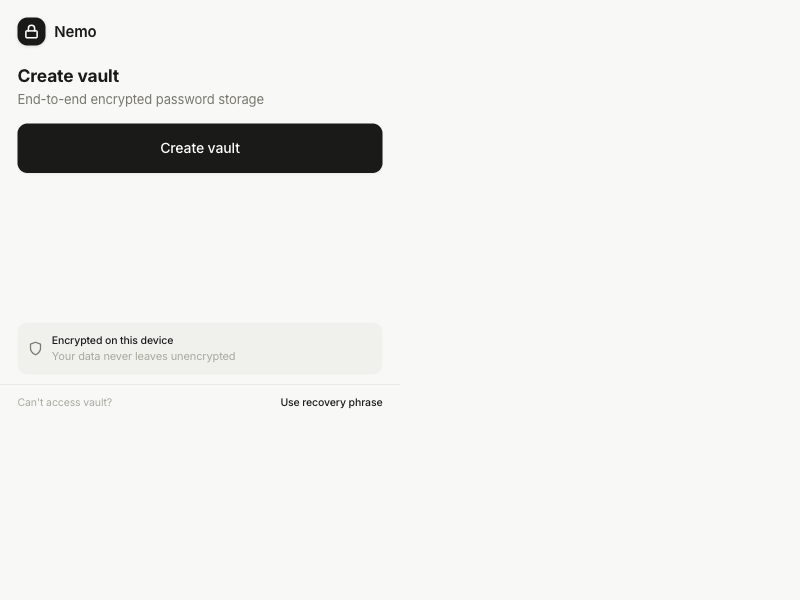
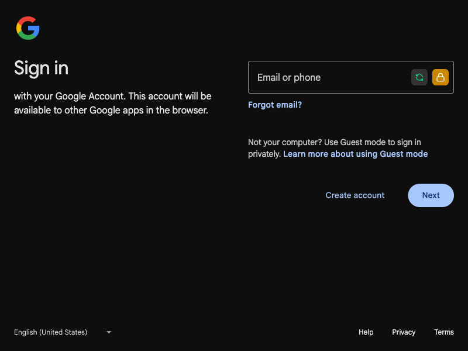
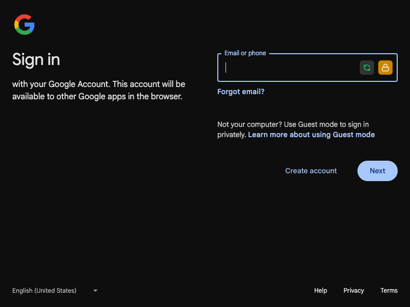

# Nemo Password Manager

A local-first password manager extension. No accounts, no cloud sync, no tracking. Your passwords stay on your device, encrypted with keys only you control.

## Disclaimer

This is a hobby project, not a commercial product. I'm not a security company. Use at your own risk.

I cannot access your passwords. If you lose your passkey and recovery phrase, your vault is gone. I cannot help you recover it.

Export your vault regularly. You are responsible for your own backups.

## What it does

- Multiple vaults (work, personal, whatever)
- Biometric unlock via WebAuthn (Touch ID, Face ID, Windows Hello)
- PIN as backup unlock method
- AES-256-GCM encryption with PBKDF2 key derivation
- 12-word recovery phrases (BIP-39)
- Auto-fill on login pages
- Export/import for backups

## Screenshots

| Locked | Unlocked |
|--------|----------|
|  |  |

| Extension Popup | Auto-fill on Google |
|-----------------|---------------------|
|  |  |

## Tech

- WXT for the extension framework
- Web Crypto API for all crypto (no third-party libs)
- WebAuthn PRF for deterministic key derivation
- OPFS for local storage
- React + Tailwind + TypeScript
- Tactical dark theme because I like how it looks

## Install

```bash
pnpm install
pnpm dev
```

Load the extension from `.output/chrome-mv3-dev` in Chrome's developer mode.

Build for production:

```bash
pnpm build
```

Firefox: `pnpm dev:firefox`

## How encryption works

Every vault has its own AES-256-GCM key generated at creation. The key never touches disk in plaintext. Instead, it gets wrapped (encrypted) by a key derived from your unlock method.

### Passkey

The browser authenticator generates a deterministic pseudo-random output via the PRF extension. Same credential + same salt = same output, every time. That output derives your wrapping key via HKDF-SHA256.

No password involved. The key comes from the authenticator hardware.

### PIN

4-6 digits, PBKDF2-SHA256 with 100,000 iterations. After 5 failed attempts, it locks for 30 minutes.

### Recovery phrase

12 words from BIP-39's 2048-word list. Encodes 128 bits of entropy. You see it once when creating the vault. If you lose it and lose your passkey, you lose access.

### Key flow

```
Passkey/PIN/Recovery → Key derivation → Wrapping key (AES-256)
                                          ↓
                                    unwrapKey()
                                          ↓
                                    Vault key (in-memory only)
                                          ↓
                                    Decrypt vault
```

Each unlock method stores its own wrapped copy of the vault key. The vault itself is encrypted with a fresh 12-byte IV on every save.

### OPFS layout

```
nemo-vault-{id}/
├── vault.enc      # Encrypted vault data + IV
├── metadata.json  # Salt, KDF type, timestamps
└── key.enc        # Wrapped vault key

vault-registry.json  # List of vaults + active ID
```

The metadata is public. Salts aren't secrets. The ciphertext needs an unwrapped vault key to mean anything.

## Project structure

```
entrypoints/
├── popup/          # Main popup UI
├── background.ts   # Service worker
├── content.ts      # Auto-fill script
└── webauthn/       # Passkey handling

vault/
├── crypto.ts       # AES-GCM, PBKDF2, HKDF
├── storage.ts       # OPFS abstraction
├── recovery.ts      # BIP-39 phrases
├── vault.ts         # Data model
└── manager.ts       # Orchestration

components/         # React components
utils/              # Legacy utilities (migrating)
```

## Crypto parameters

| Operation | Algorithm | Key size | Salt/Iterations |
|-----------|-----------|----------|-----------------|
| Vault encryption | AES-256-GCM | 256-bit | 12-byte IV per write |
| Key wrapping | AES-GCM | — | 12-byte IV |
| PIN derivation | PBKDF2-SHA256 | 256-bit | 100,000 iter, 32-byte salt |
| PRF → wrapping | HKDF-SHA256 | 256-bit | 16-byte salt |
| Recovery → wrapping | HKDF-SHA256 | 256-bit | fixed salt |
| Random values | crypto.getRandomValues() | — | — |

## What works

Create multiple vaults, unlock with passkey or PIN, add/edit/delete entries, auto-fill on websites, export for backup.

## What doesn't

No cloud sync. No cross-device sharing (yet). WebAuthn PRF support varies by browser. Safari works but has quirks.

## License

Apache 2.0. See [LICENSE](LICENSE).

## Privacy

See [PRIVACY_POLICY.md](PRIVACY_POLICY.md).